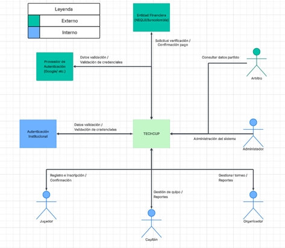

# ⚽ TECHCUP FÚTBOL
## Software Requirements Specification (SRS)

Plataforma digital para la gestión del torneo semestral de fútbol del programa de Ingeniería de Sistemas, Inteligencia Artificial, Ciberseguridad y Estadística de la Escuela Colombiana de Ingeniería Julio Garavito.

---

# 📖 1. Introducción

El presente documento describe los requerimientos de software para el desarrollo de TECHCUP, una solución tecnológica que centraliza la gestión de torneos de fútbol dentro de la universidad.

El sistema permitirá:

- Gestionar torneos
- Administrar equipos
- Registrar participantes
- Consultar partidos y resultados
- Simplificar el proceso de inscripción
- Centralizar la información del torneo

La plataforma será una aplicación web que permitirá la interacción organizada entre todos los participantes del torneo.

---

# 🧭 2. Descripción General del Sistema

TECHCUP será una plataforma web diseñada para facilitar la gestión del torneo de fútbol universitario.

El sistema permitirá a los usuarios interactuar mediante una interfaz web según su rol dentro de la plataforma.

La información será almacenada en una base de datos y el sistema interactuará con servicios externos como:

- Servicios de autenticación
- Servicios financieros

---

# 👥 2.1 Roles del Sistema

| Rol | Descripción |
|----|----|
| Jugador | Puede registrarse en equipos y participar en torneos. |
| Capitán | Crea y gestiona equipos y los inscribe en torneos. |
| Árbitro | Consulta información sobre los partidos que debe arbitrar. |
| Organizador | Crea y gestiona los torneos. |
| Administrador | Controla el funcionamiento general del sistema. |

---

# ⚙️ 2.2 Suposiciones y Dependencias

El sistema depende de los siguientes elementos:

- Conexión a internet para su funcionamiento.
- Servicios externos de autenticación.
- Servicios financieros para validar pagos.

**Dependencias**

- D1: Servicios de autenticación  
- D2: Servicios financieros

---

# 📋 3. Requerimientos Funcionales

Los requerimientos funcionales describen las acciones que el sistema debe realizar.

| ID | Requerimiento |
|----|----|
| RF-01 | El sistema permite al organizador crear y gestionar un torneo. |
| RF-02 | El sistema permite a un capitán inscribir a su equipo a un torneo. |
| RF-03 | El sistema permite consultar información del torneo y sus partidos. |
| RF-04 | El sistema permite registrar el pago mediante comprobante. |
| RF-05 | El sistema actualiza automáticamente resultados y estadísticas. |
| RF-06 | El sistema define automáticamente los partidos de fase de grupos. |
| RF-07 | El sistema registra automáticamente las acciones realizadas. |
| RF-08 | El sistema ofrece funcionalidades según el rol del usuario. |
| RF-09 | El sistema permite autenticación mediante correo electrónico. |
| RF-10 | El sistema permite al árbitro consultar información de partidos. |
| RF-11 | El sistema no permite cambiar integrantes de un equipo en torneo activo. |
| RF-12 | El capitán puede organizar su equipo antes de un partido. |
| RF-13 | Solo equipos con pago aprobado participan en el torneo. |
| RF-14 | El capitán puede subir comprobante de pago. |
| RF-15 | El organizador recibe notificación de nuevos comprobantes. |
| RF-16 | Los usuarios pueden consultar alineaciones de equipos. |
| RF-17 | Los capitanes pueden buscar jugadores para su equipo. |
| RF-18 | Un usuario puede registrarse como jugador. |
| RF-19 | Un usuario puede registrarse como capitán. |

---

# 🧩 4. Requerimientos No Funcionales

Los requerimientos no funcionales describen las características técnicas y de calidad del sistema.

| ID | Requerimiento |
|----|----|
| RNF-01 | La base de datos del sistema será PostgreSQL. |
| RNF-02 | El backend utilizará API REST con Spring Boot. |
| RNF-03 | El sistema tendrá arquitectura por capas: controladores, adaptadores, lógica y datos. |
| RNF-04 | El sistema mostrará estadísticas del torneo como goleadores e historial de partidos. |
| RNF-05 | El sistema mostrará estadísticas de equipos: partidos jugados, ganados, empatados, perdidos y goles. |
| RNF-06 | El sistema registrará estadísticas de partidos como marcador, goleadores y tarjetas. |

---

# 📊 5. Diagramas

El sistema incluirá los siguientes diagramas de diseño:

##  Diagrama de contexto:

- Diagramas UML
- Diagramas de casos de uso

Estos diagramas permitirán comprender las interacciones entre el sistema y sus actores.

---

# 🏗 Tecnologías del Sistema

El sistema se desarrollará con la siguiente arquitectura tecnológica:

- **Backend:** Spring Boot
- **API:** REST
- **Frontend:** React + Typescript
- **Base de datos:** PostgreSQL

---

# 🎯 Objetivo del Sistema

TECHCUP busca transformar la organización del torneo universitario de un proceso manual a una plataforma digital centralizada, mejorando:

- la organización del torneo
- la transparencia en resultados
- la comunicación entre participantes
- la gestión de equipos y partidos

---