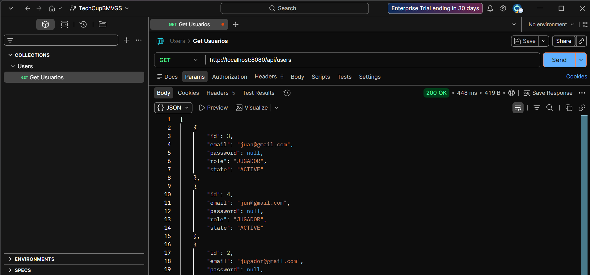
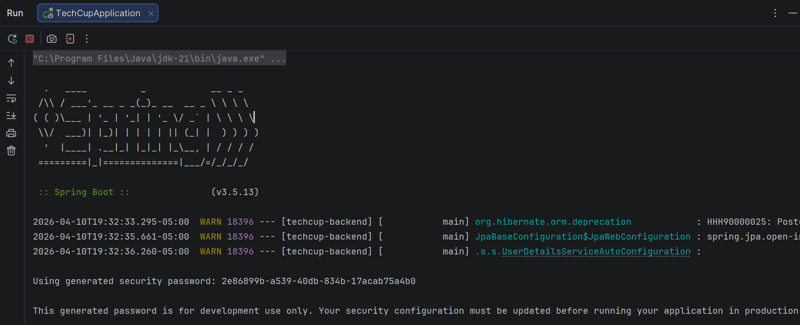
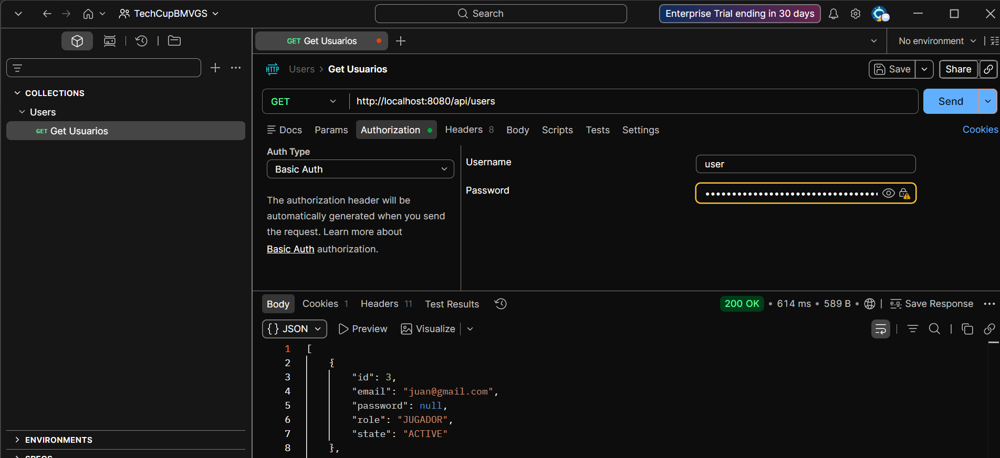
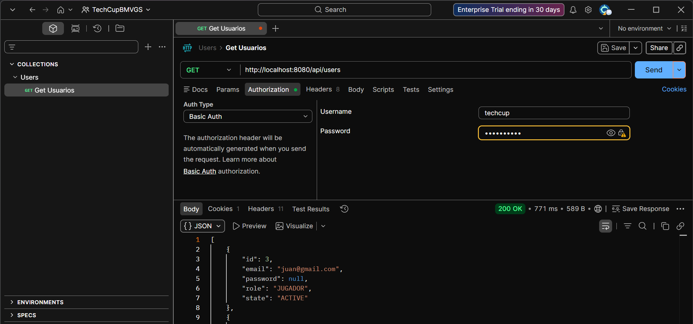

<div align="center">

<br/>

```
████████╗███████╗ ██████╗██╗  ██╗ ██████╗██╗   ██╗██████╗ 
╚══██╔══╝██╔════╝██╔════╝██║  ██║██╔════╝██║   ██║██╔══██╗
   ██║   █████╗  ██║     ███████║██║     ██║   ██║██████╔╝
   ██║   ██╔══╝  ██║     ██╔══██║██║     ██║   ██║██╔═══╝ 
   ██║   ███████╗╚██████╗██║  ██║╚██████╗╚██████╔╝██║     
   ╚═╝   ╚══════╝ ╚═════╝╚═╝  ╚═╝ ╚═════╝ ╚═════╝ ╚═╝     
```

### ⚽ Plataforma de Gestión del Torneo de Fútbol — ECI

[](https://openjdk.org/)
[](https://spring.io/projects/spring-boot)
[](https://maven.apache.org/)
[](https://junit.org/junit5/)
[](https://www.jacoco.org/)
[](https://www.sonarsource.com/)
[](https://escuelaing.edu.co/)

<br/>

*Escuela Colombiana de Ingeniería Julio Garavito — DOSW · Grupo Beta*

</div>

---

## 🏆 Sobre el proyecto

**TechCup** es una plataforma web para la gestión integral del torneo semestral de fútbol de los programas de Ingeniería de Sistemas, Inteligencia Artificial, Ciberseguridad y Estadística de la ECI.

El sistema centraliza:

- 👤 Registro y autenticación de usuarios por dominio institucional
- ⚽ Perfiles deportivos de jugadores
- 🛡️ Gestión de equipos e inscripciones
- 🏟️ Administración de torneos y partidos
- 📊 Estadísticas, tabla de posiciones y llaves eliminatorias
- 🔍 Log de auditoría de acciones del sistema

---

## 👥 Equipo de desarrollo

<div align="center">

| # | Nombre |
|---|--------|
| 1 | **Kevin Segura** |
| 2 | **Juan Pablo Vélez Muñoz** |
| 3 | **Juan Daniel Bogotá** |
| 4 | **Cristian González** |
| 5 | **Rafael Moreno** |

</div>

---

## 📁 Estructura del proyecto

A partir del **Laboratorio 8** el proyecto migró de Java plano a **Spring Boot**, adoptando una arquitectura en capas. La estructura de paquetes es:

```
src/main/java/edu/dosw/techcup/
│
├── TechcupApplication.java        ← Punto de entrada Spring Boot
│
├── controller/                    ← Recibe peticiones HTTP — @RestController
├── service/                       ← Lógica de negocio — @Service
├── repository/                    ← Acceso a BD — @Repository (Sprint 2)
├── entity/                        ← Clases del modelo de datos
│   ├── Action.java                ← Enum: LOGIN, LOGOUT, etc.
│   ├── AuditAction.java           ← Registro de auditoría
│   ├── IAuthenticable.java        ← Interfaz de autenticación
│   ├── Manager.java               ← Rol administrador
│   ├── MemberState.java           ← Enum: ACTIVE, UNACTIVE, SUSPENDED
│   ├── Organizer.java             ← Rol organizador
│   ├── ParticipantType.java       ← Enum: STUDENT, TEACHER, etc.
│   ├── Player.java                ← Entidad jugador
│   ├── Position.java              ← Enum: GOALKEEPER, STRIKER, etc.
│   ├── Tournament.java            ← Entidad torneo
│   ├── TournamentState.java       ← Enum: BORRADOR, ACTIVO, etc.
│   └── User.java                  ← Clase base de usuario
├── dto/                           ← Objetos de transferencia de datos
├── exception/                     ← Manejo centralizado de errores
└── config/                        ← Configuración Swagger y otros
```

> **Nota:** En el Laboratorio 6 el modelo estaba organizado en subpaquetes `model/user`, `model/audit` y `model/player`. Al migrar a Spring Boot en el Lab 7, todas las clases se consolidaron en el paquete `entity/` siguiendo la arquitectura estándar de Spring.

---

## 🛠️ Tecnologías

| Componente | Tecnología |
|------------|------------|
| Lenguaje | Java 17 |
| Gestor de dependencias | Apache Maven 3.8+ |
| Framework backend | Spring Boot 3.2.5 |
| Base de datos *(Sprint 2)* | PostgreSQL |
| Imágenes *(Sprint 3)* | MongoDB (microservicio) |
| Seguridad *(Sprint 2)* | Spring Security + JWT |
| Pruebas unitarias | JUnit 5 — incluido en `spring-boot-starter-test` |
| Pruebas de comportamiento | Mockito 5.14.2 |
| Cobertura | JaCoCo 0.8.12 |
| Análisis estático | SonarQube |
| Documentación API | Springdoc OpenAPI (Swagger UI) |
| CI/CD | GitHub Actions |
| Contenedores | Docker + Docker Compose |

---

## Preguntas sobre capas de springboot

### 1. ¿Para qué sirve el paquete `Controller` en la estructura Spring Boot?

El paquete **Controller** es la capa de presentación o capa web de la aplicación. Su función principal es recibir las solicitudes HTTP entrantes (GET, POST, PUT, DELETE, etc.) desde el cliente, procesarlas y devolver una respuesta adecuada.

En Spring Boot, las clases dentro de este paquete se anotan con `@RestController` o `@Controller`. Son responsables de:

- Mapear las rutas URL a métodos específicos mediante anotaciones como `@GetMapping`, `@PostMapping`, `@PutMapping` y `@DeleteMapping`.
- Recibir parámetros de la petición (`@RequestParam`, `@PathVariable`, `@RequestBody`).
- Delegar la lógica de negocio a la capa de servicio.
- Retornar respuestas al cliente, generalmente en formato JSON o XML.

```java
@RestController
@RequestMapping("/api/usuarios")
public class UsuarioController {

    @Autowired
    private UsuarioService usuarioService;

    @GetMapping("/{id}")
    public ResponseEntity<UsuarioDTO> obtenerUsuario(@PathVariable Long id) {
        return ResponseEntity.ok(usuarioService.obtenerPorId(id));
    }
}
```

---

### 2. ¿Para qué sirve el paquete `Service` en la estructura Spring Boot?

El paquete **Service** contiene la lógica de negocio de la aplicación. Actúa como intermediario entre la capa Controller y la capa Repository, garantizando la separación de responsabilidades.

Las clases en este paquete se anotan con `@Service` y son responsables de:

- Implementar las reglas de negocio de la aplicación.
- Coordinar las operaciones entre uno o más repositorios.
- Realizar validaciones, transformaciones y cálculos necesarios.
- Gestionar transacciones mediante `@Transactional`.
- Convertir entidades a DTOs y viceversa.

```java
@Service
public class UsuarioService {

    @Autowired
    private UsuarioRepository usuarioRepository;

    @Transactional(readOnly = true)
    public UsuarioDTO obtenerPorId(Long id) {
        Usuario usuario = usuarioRepository.findById(id)
            .orElseThrow(() -> new ResourceNotFoundException("Usuario no encontrado"));
        return new UsuarioDTO(usuario);
    }
}
```

---

### 3. ¿Para qué sirve el paquete `Repository` en la estructura Spring Boot?

El paquete **Repository** es la capa de acceso a datos (DAL - Data Access Layer). Su responsabilidad es interactuar directamente con la base de datos para realizar operaciones CRUD (Crear, Leer, Actualizar, Eliminar).

En Spring Boot, las interfaces en este paquete generalmente extienden `JpaRepository`, `CrudRepository` o `PagingAndSortingRepository`, y se anotan con `@Repository`. Son responsables de:

- Proveer métodos predefinidos para operaciones básicas con la base de datos.
- Permitir la creación de consultas personalizadas mediante `@Query` o convenciones de nombres de métodos.
- Abstraer la lógica de persistencia del resto de la aplicación.
- Integrarse con JPA/Hibernate para el mapeo objeto-relacional.

```java
@Repository
public interface UsuarioRepository extends JpaRepository<Usuario, Long> {

    Optional<Usuario> findByEmail(String email);

    @Query("SELECT u FROM Usuario u WHERE u.activo = true")
    List<Usuario> findAllActivos();
}
```

---

### 4. ¿Para qué sirve el paquete `Controller` en la estructura Spring Boot?

> *Nota: Esta pregunta es una repetición de la pregunta 1. Se amplía con información adicional sobre los tipos de controladores.*

Adicionalmente a lo mencionado, es importante diferenciar los dos tipos principales de controladores en Spring Boot:

- **`@Controller`**: Se utiliza en aplicaciones MVC tradicionales donde se retornan vistas (HTML, Thymeleaf, JSP). Requiere `@ResponseBody` en los métodos para retornar datos en lugar de vistas.

- **`@RestController`**: Es una combinación de `@Controller` y `@ResponseBody`. Se usa en APIs RESTful y retorna datos directamente en el cuerpo de la respuesta (generalmente JSON).

El paquete Controller también puede contener clases de manejo de excepciones globales usando `@ControllerAdvice` o `@RestControllerAdvice`, que capturan errores de toda la aplicación y devuelven respuestas coherentes al cliente.

```java
@RestControllerAdvice
public class GlobalExceptionHandler {

    @ExceptionHandler(ResourceNotFoundException.class)
    public ResponseEntity<ErrorResponse> handleNotFound(ResourceNotFoundException ex) {
        return ResponseEntity.status(HttpStatus.NOT_FOUND)
            .body(new ErrorResponse(ex.getMessage()));
    }
}
```

---

### 5. ¿Para qué sirve el paquete `Entity` en la estructura Spring Boot?

El paquete **Entity** (también llamado `model` o `domain`) contiene las clases que representan las tablas de la base de datos. Cada clase entidad se mapea directamente a una tabla en la base de datos relacional mediante JPA (Java Persistence API).

Las clases en este paquete se anotan con `@Entity` y son responsables de:

- Definir la estructura de los datos persistidos en la base de datos.
- Establecer relaciones entre tablas (`@OneToMany`, `@ManyToOne`, `@ManyToMany`, `@OneToOne`).
- Configurar restricciones y validaciones a nivel de columna.
- Definir claves primarias (`@Id`) y estrategias de generación (`@GeneratedValue`).

```java
@Entity
@Table(name = "usuarios")
public class Usuario {

    @Id
    @GeneratedValue(strategy = GenerationType.IDENTITY)
    private Long id;

    @Column(nullable = false, unique = true)
    private String email;

    @Column(nullable = false)
    private String nombre;

    private boolean activo;

    // Getters y Setters
}
```

---

### 6. ¿Para qué sirve el paquete `DTO` en la estructura Spring Boot?

El paquete **DTO** (Data Transfer Object) contiene clases que actúan como objetos de transferencia de datos entre las capas de la aplicación o entre el servidor y el cliente. Su propósito es desacoplar la representación interna de los datos (entidades) de la representación expuesta al exterior.

Las clases DTO son responsables de:

- Exponer únicamente los campos necesarios para cada operación, evitando exponer información sensible de las entidades.
- Reducir el número de llamadas remotas agrupando datos de múltiples fuentes.
- Adaptar la estructura de datos según las necesidades del cliente o de cada caso de uso.
- Prevenir problemas de serialización circular en relaciones bidireccionales entre entidades.

```java
public class UsuarioDTO {

    private Long id;
    private String nombre;
    private String email;
    // No se incluye la contraseña ni datos sensibles

    public UsuarioDTO(Usuario usuario) {
        this.id = usuario.getId();
        this.nombre = usuario.getNombre();
        this.email = usuario.getEmail();
    }

    // Getters y Setters
}
```

---

### 7. ¿Para qué sirve el paquete `Exception` en la estructura Spring Boot?

El paquete **Exception** centraliza la definición y el manejo de excepciones personalizadas de la aplicación. Permite implementar un manejo de errores consistente y significativo a lo largo de todo el proyecto.

Las clases en este paquete son responsables de:

- Definir excepciones personalizadas que representan errores específicos del dominio de negocio.
- Proporcionar mensajes de error claros y códigos de estado HTTP apropiados.
- Centralizar el manejo de errores evitando la duplicación de código en los servicios y controladores.
- Facilitar el mantenimiento y la legibilidad del código relacionado con el manejo de errores.

```java
// Excepción personalizada
public class ResourceNotFoundException extends RuntimeException {

    public ResourceNotFoundException(String message) {
        super(message);
    }
}

// Respuesta de error estandarizada
public class ErrorResponse {

    private String mensaje;
    private int codigo;
    private LocalDateTime timestamp;

    public ErrorResponse(String mensaje) {
        this.mensaje = mensaje;
        this.timestamp = LocalDateTime.now();
    }

    // Getters y Setters
}
```

---

## 📦 Evolución del `pom.xml` — Lab 6 → Lab 7

En el **Laboratorio 6** el `pom.xml` era un proyecto Maven plano con JUnit como dependencia explícita y sin servidor web:

```xml
<!-- Lab 6 — dependencia manual de JUnit -->
<dependency>
    <groupId>org.junit.jupiter</groupId>
    <artifactId>junit-jupiter</artifactId>
    <version>5.10.2</version>
    <scope>test</scope>
</dependency>
```

En el **Laboratorio 7** se adoptó Spring Boot como parent del proyecto, lo que trajo dos cambios importantes:

**1. JUnit ya no se declara explícitamente** — `spring-boot-starter-test` lo incluye automáticamente junto con Mockito y AssertJ:

```xml
<!-- Lab 7 — JUnit incluido en el starter de test -->
<dependency>
    <groupId>org.springframework.boot</groupId>
    <artifactId>spring-boot-starter-test</artifactId>
    <scope>test</scope>
</dependency>
```

**2. Se agregó el `spring-boot-maven-plugin`** — necesario para levantar la aplicación con `mvn spring-boot:run` y para generar el `.jar` ejecutable:

```xml
<plugin>
    <groupId>org.springframework.boot</groupId>
    <artifactId>spring-boot-maven-plugin</artifactId>
</plugin>
```

Se mantuvieron de Lab 6: **JaCoCo** (cobertura ≥ 85%) y **SonarQube** (análisis estático).

---

## 🧪 Pruebas unitarias

El proyecto aplica **TDD (Test-Driven Development)** siguiendo el ciclo **Rojo → Verde → Refactor**. Cada prueba sigue la estructura **Having / When / Then**.

### Requerimientos cubiertos con pruebas en el Sprint 1

| Requerimiento | Descripción | Servicio |
|---|---|---|
| RF-01 | Registro de usuario con dominio válido | `UserService` |
| RF-04 | Gestión de usuarios — listar, inactivar, cambiar rol | `UserService` |
| RF-05 | Registro de acciones en log de auditoría | `AuditActionService` |
| RF-06 | Consulta del log de auditoría | `AuditActionService` |

### `AuditActionServiceTest` — RF-05 y RF-06

| # | Nombre del test | Descripción |
|---|-----------------|-------------|
| 1 | `shouldRegisterFirstAction` | Registra la primera acción de auditoría correctamente |
| 2 | `shouldRegisterAction` | Registra múltiples acciones y verifica el último registro |
| 3 | `shouldNotRegisterInvalidUser` | No registra una acción `null` |
| 4 | `shouldNotRegisterDuplicatedId` | No sobreescribe un registro con ID duplicado |
| 5 | `shouldReturnEmptyLogs` | Retorna lista vacía cuando no hay registros |
| 6 | `shouldReturnLogs` | Retorna correctamente todos los registros almacenados |

### `UserServiceTest` — RF-01 y RF-04

| # | Nombre del test | Descripción |
|---|-----------------|-------------|
| 1 | `shouldRegisterUserWithEciEmail` | Registra un usuario con correo `@escuelaing.edu.co` |
| 2 | `shouldRegisterUserWithGmailEmail` | Registra un usuario con correo `@gmail.com` |
| 3 | `shouldNotRegisterUserWithInvalidEmailDomain` | Rechaza dominios no permitidos (ej. `@hotmail.com`) |
| 4 | `shouldNotRegisterUserWithNullEmail` | Rechaza correos nulos |
| 5 | `shouldNotRegisterDuplicateEmail` | No permite registrar el mismo correo dos veces |
| 6 | `shouldGetAllRegisteredUsers` | Lista todos los usuarios registrados |
| 7 | `shouldGetUserById` | Recupera un usuario por su ID |
| 8 | `shouldReturnNullForNonExistentUserId` | Retorna `null` si el ID no existe |
| 9 | `shouldGetUserByEmail` | Recupera un usuario por su correo |
| 10 | `shouldInactivateUser` | Cambia el estado del usuario a `UNACTIVE` |
| 11 | `shouldSuspendUser` | Cambia el estado del usuario a `SUSPENDED` |
| 12 | `shouldActivateInactiveUser` | Reactiva un usuario previamente inactivo |
| 13 | `shouldThrowExceptionWhenInactivatingNonExistentUser` | Lanza excepción si el usuario no existe |

### Ejecutar los tests

```bash
mvn test
```

Resultado esperado:

```
[INFO] Tests run: 19, Failures: 0, Errors: 0, Skipped: 0
[INFO] BUILD SUCCESS
```


---

## 📊 Cobertura con JaCoCo

JaCoCo mide el porcentaje de código cubierto por las pruebas. El objetivo del proyecto es **≥ 85% por paquete**.


> La cobertura actual es del **70%** correspondiente al Sprint 1. Se incrementará en los siguientes sprints al cubrir los módulos de equipos, torneos y partidos.

---

## 🔍 Análisis estático con SonarQube

```bash
# 1. Levantar SonarQube
docker run -d --name sonarqube -e SONAR_ES_BOOTSTRAP_CHECKS_DISABLE=true -p 9000:9000 sonarqube:latest

# 2. Ejecutar análisis
mvn verify sonar:sonar -Dsonar.token=TU_TOKEN
```

Ver resultados en `http://localhost:9000`

---

# Lab 8 
## Entidades del dominio seleccionadas

### Entidades elegidas

#### 1. `User`
Representa a cualquier persona registrada en el sistema.  
**Justificación:** Entidad central del dominio. Cubre la **autenticación**
(email, password, tokens) y el **CRUD de usuarios**.

**Atributos principales:**
- `id` (Long, PK)
- `username` (String)
- `email` (String, único)
- `password` (String, hasheado)
- `role` (Enum: UserRole)
- `createdAt` / `updatedAt` (Timestamps)

---

#### 2. `Player`
Representa el perfil deportivo de un usuario dentro del sistema.  
**Justificación:** Es la entidad que identifica a los participantes
de los torneos con sus datos deportivos específicos. Se relaciona
con `User` (perfil base) y con `Tournament` (participación).

**Atributos principales:**
- `id` (Long, PK)
- `name` (String)
- `dorsal` (int)
- `position` (Enum: Position)
- `participantType` (Enum: ParticipantType)
- `semester` (int)
- `available` (boolean)

---

#### 3. `Tournament`
Representa un torneo creado en el sistema.  
**Justificación:** Entidad principal del negocio. Cubre el
**CRUD de torneos** y se relaciona con `User` (organizador)
y `Player` (participantes).

**Atributos principales:**
- `id` (Long, PK)
- `name` (String)
- `state` (Enum: TournamentState)
- `organizerId` (FK → User)
- `createdAt` / `updatedAt` (Timestamps)

---

### Relaciones entre entidades

| Entidad A | Relación | Entidad B | Descripción |
|-----------|----------|-----------|-------------|
| `User` | 1:1 | `Player` | Un usuario tiene un perfil de jugador |
| `User` | 1:N | `Tournament` | Un usuario puede organizar varios torneos |
| `Player` | N:M | `Tournament` | Un jugador puede participar en varios torneos |

---

### Cobertura de funcionalidades requeridas

| Funcionalidad requerida | Entidad responsable |
|-------------------------|---------------------|
| Autenticación           | `User`              |
| CRUD Usuarios           | `User`              |
| CRUD Torneos            | `Tournament`        |
| Participación en torneos| `Player`            |


## Paso 8. Crear la base de datos PostgreSQL

| CONTAINER ID | IMAGE    | COMMAND                  | CREATED          | STATUS         | PORTS                    | NAMES         |
|--------------|----------|--------------------------|------------------|----------------|--------------------------|---------------|
| 61d2c77aac8c | postgres | "docker-entrypoint.s…"   | 32 seconds ago   | Up 29 seconds  | 0.0.0.0:5432->5432/tcp   | postgres-lab8 |


# Lab 9

## Prueba de API con Postman - GET Usuarios

### Descripción
Petición para obtener todos los usuarios registrados en el sistema.

### Configuración de la petición

| Campo  | Valor                                  |
|--------|----------------------------------------|
| Método | GET                                    |
| URL    | http://localhost:8080/api/users        |
| Header | Content-Type: application/json         |

### Resultado obtenido



### Respuesta esperada

- **Código:** 200 OK
- **Formato:** JSON
- **Body:**


#  Spring Boot Security

##  Configuración

Se agregó la dependencia de Spring Security en el proyecto y se ejecutó la aplicación.  
Al consumir el endpoint `/users`, ahora se solicita autenticación.

##  Evidencia 1 - Solicitud de autenticación



---

##  Autenticación por defecto

- Usuario: `user`
- Contraseña: generada en consola al iniciar la aplicación.

Se configuró Basic Auth en Postman y se ejecutó nuevamente la petición.

## Evidencia 2 - Acceso con credenciales por defecto
)

---

## Configuración personalizada

Se definieron nuevas credenciales en `application.properties`:
spring.security.user.name=admin
spring.security.user.password=1234


Se reinició la aplicación y se actualizaron las credenciales en Postman.

##  Evidencia 3 - Acceso con credenciales personalizadas
)


---

<div align="center">

**DOSW Company** · Escuela Colombiana de Ingeniería Julio Garavito · 2025.
</div>


